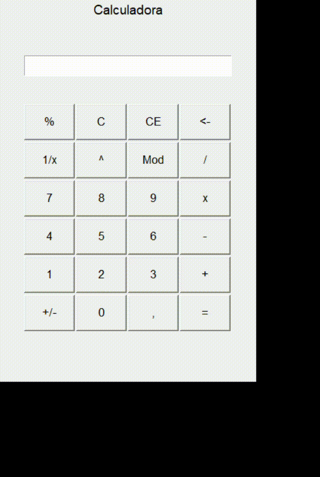

<div align='center'>
    <h1>Calculadora Tk</h1>
    
</div>
## _Calculadora GUI hecha en Python usando tkinter_
[](#py-calculator)

[](https://www.python.org/)
[](https://docs.python.org/3/library/tkinter.html)

**Calculadora** Proyecto Calculadora en Python Tkinter realizado en Pro.Avanzando 1:


Py-Calculadora. es una aplicación de calculadora GUI con todas las funcionalidades básicas de una calculadora escrita completamente en Python3 utilizando el marco tkinter.

Puede ejecutarse en cualquier sistema que ejecute Python 3 o superior y tenga la biblioteca tkinter.

Instantánea del programa que se ejecuta en entorno Linux y Windows:

[

## Características 

- Peso ligero
- Fuente abierta
- Sin atributos ocultos
- Soporte multiplataforma
- Código fuente fácil de entender

## Requisitos
Para que el programa se ejecute, necesita que las siguientes dependencias estén instaladas en Python:

- matemáticas
- tkinter
- tkinter.constantes

_Si no está presente, instale las bibliotecas usando pip o cualquier otra forma de su elección._

## Como correr
Como se mencionó anteriormente, se requiere Python versión 3 para ejecutar este programa.

- Primero navegue hasta la carpeta 'Py-Calculator'.
- Luego ejecute el siguiente comando:
```sh
python3 Calculadora.py
```
- & ignore si aparece alguna advertencia a menos que entre en conflicto con el comportamiento del programa.

## Nota
>El relleno de botones en el código se comporta de manera diferente en diferentes sistemas operativos, así que calibrelos de acuerdo con la interfaz gráfica de usuario de la aplicación cambiando los valores de ' padx ' y ' pady ' después de ejecutarla en su sistema.

>& iY si el ícono de la aplicación no aparece, cambie la siguiente ruta a la ubicación del archivo icon.png en su disco.
```py
photo = tk.PhotoImage(file = "<full path of the icon.png file in the res folder>")
```

## Licencia

Este proyecto está bajo la licencia pública general  _GNU General Public License v3.0_

Siéntete libre de utilizar este proyecto como quieras, es gratuito y de código abierto.


